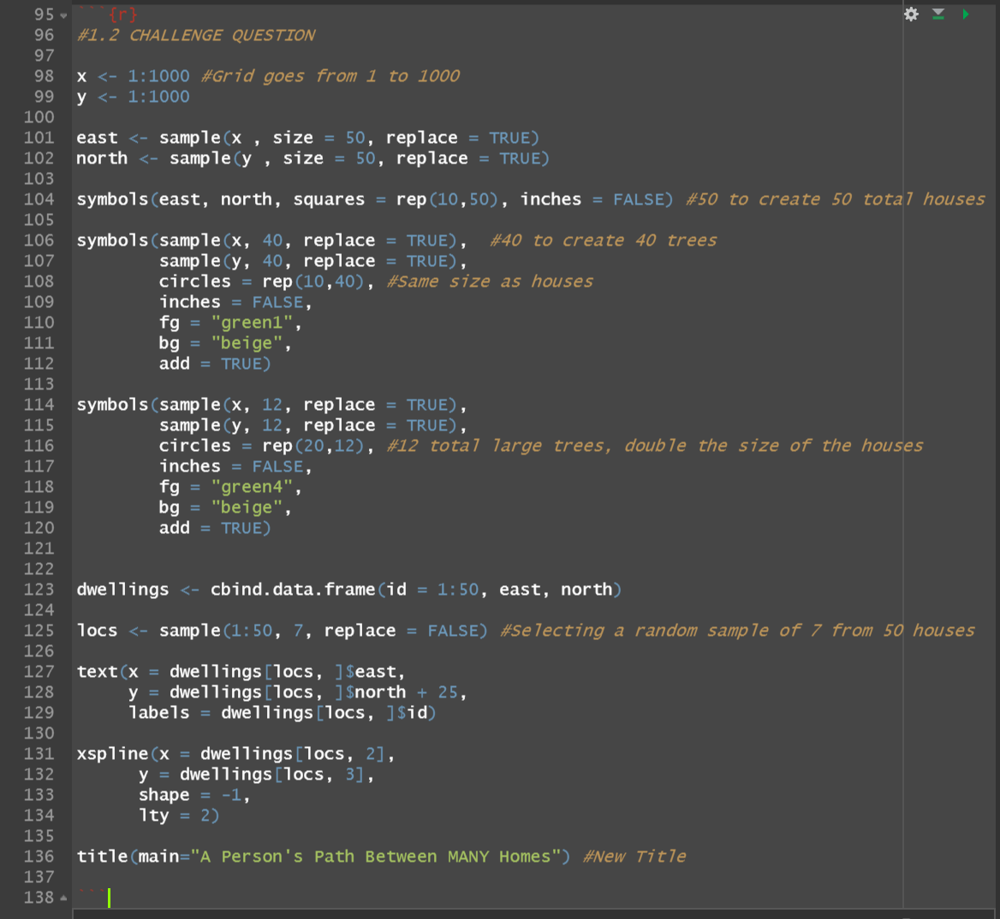

# DATA 100 Day 2

[Back to Home Page](https://jeremy-swack.github.io/wicked-problems/)

## A Person's Path between MANY Homes

This plot shows a person's path between 7 different randomly selected homes. Using the command xspline, the person takes a curved pathway, rather than a straight line one.

## My Code:

