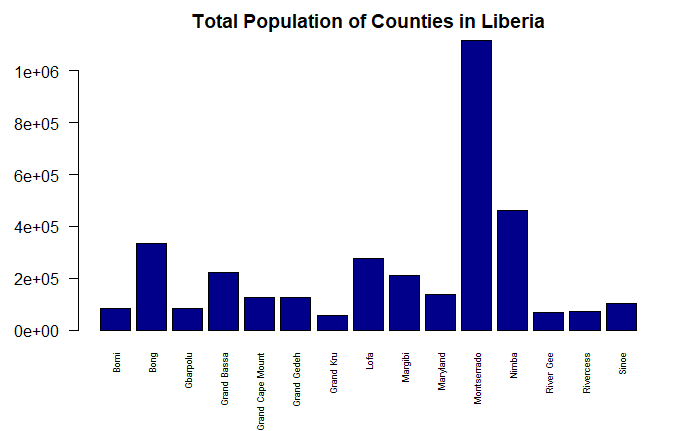
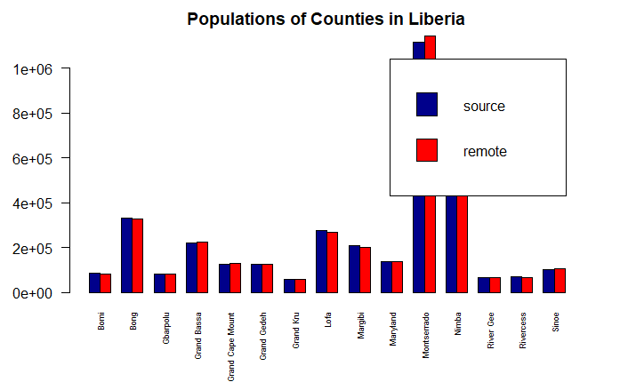
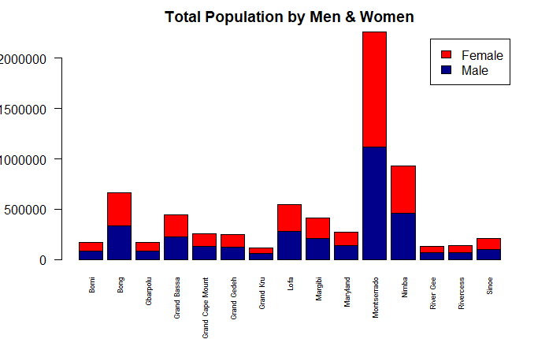
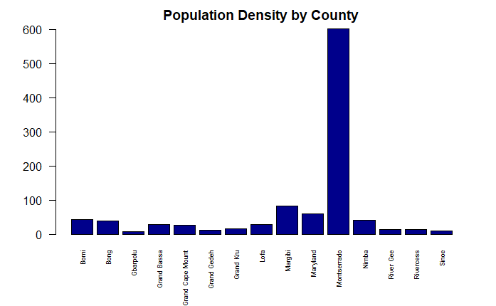
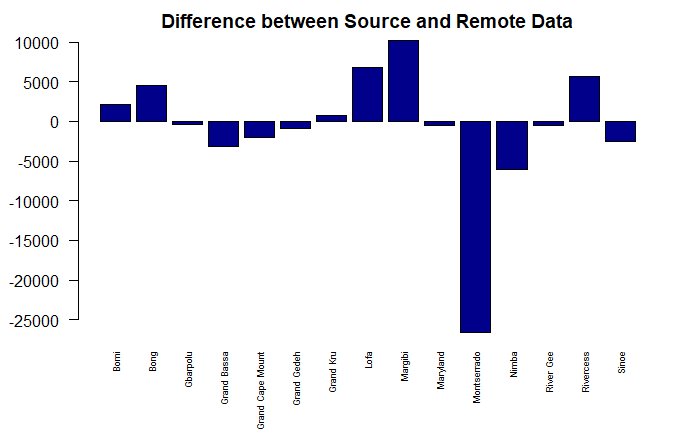
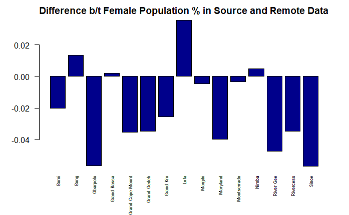

# Data Management Basics

[Back to Home Page](https://jeremy-swack.github.io/wicked-problems/)

The following 6 graphs depict different characteristics about population data from various counties in Liberia. Data was taken from 2 sources; one set is remote U.S. data, and the other is directly from Liberia. 

## Bar Graphs

This plot breaks down each individual county by its total population.

This plot breaks down each county's population by its direct source and its remote source.

This plot breaks down each county's population by gender.

This plot breaks down each county's population by population density (people/square foot)

This plot shows the difference in total population between the source data set and the remote data set.

This plot shows the difference in female population percentage between the source data set and the remote set.
