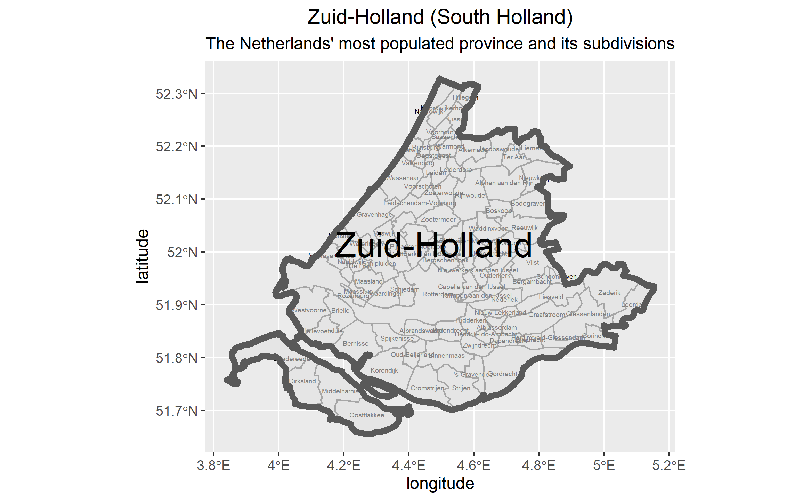
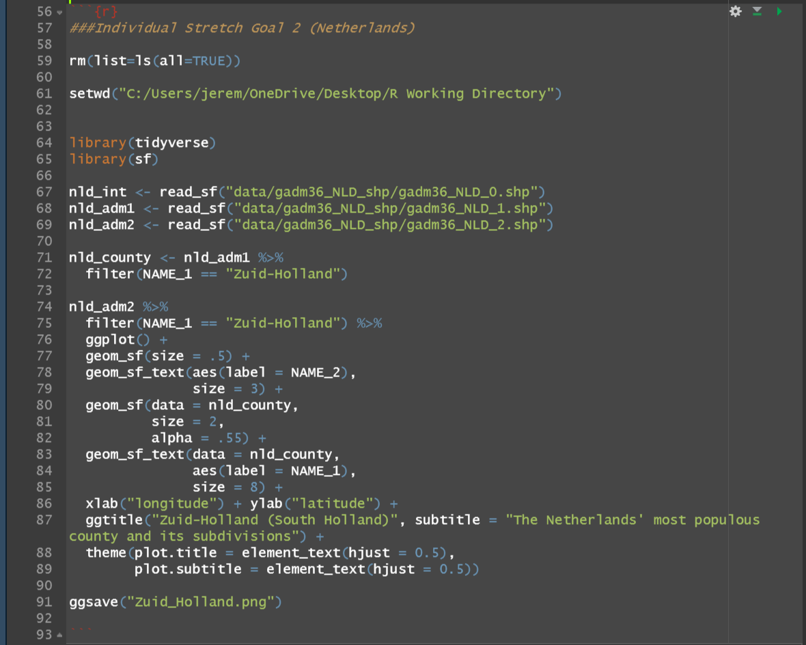

# Second Individual Stretch Goal

[Back to Home Page](https://jeremy-swack.github.io/wicked-problems/)

## Map of The Netherlands' most populous county

Zuid Holland, or South Holland, is the most populous county in the Netherlands. Even when just veiwing this county on its own, the abundance of smaller subdivisions make the map difficult to read

## My Code:

