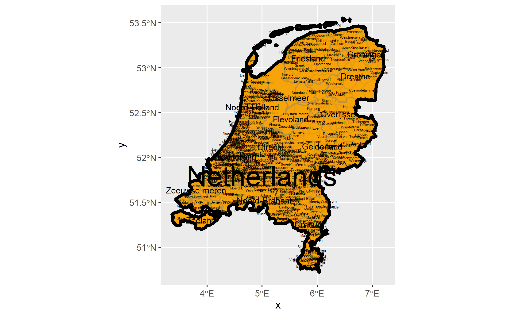
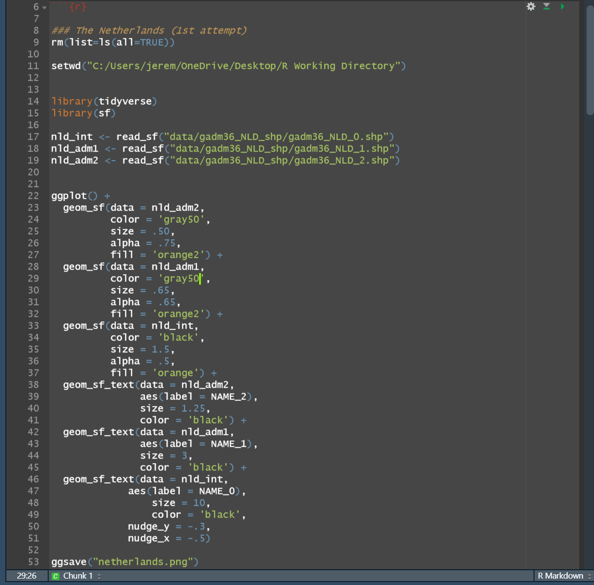
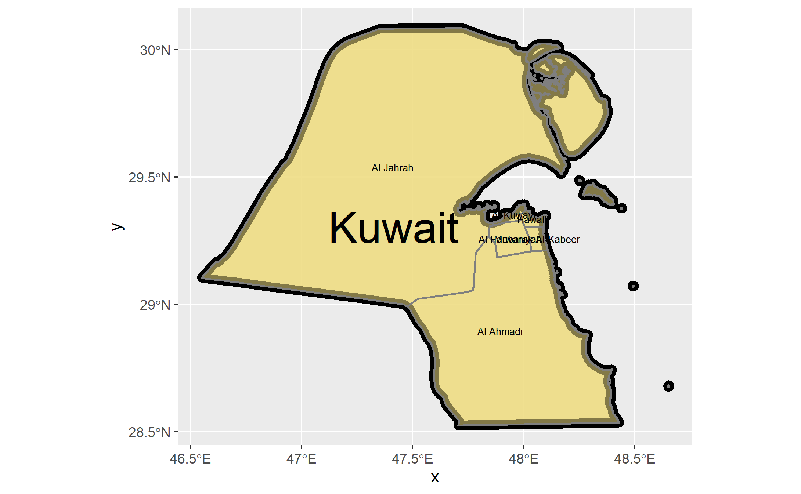
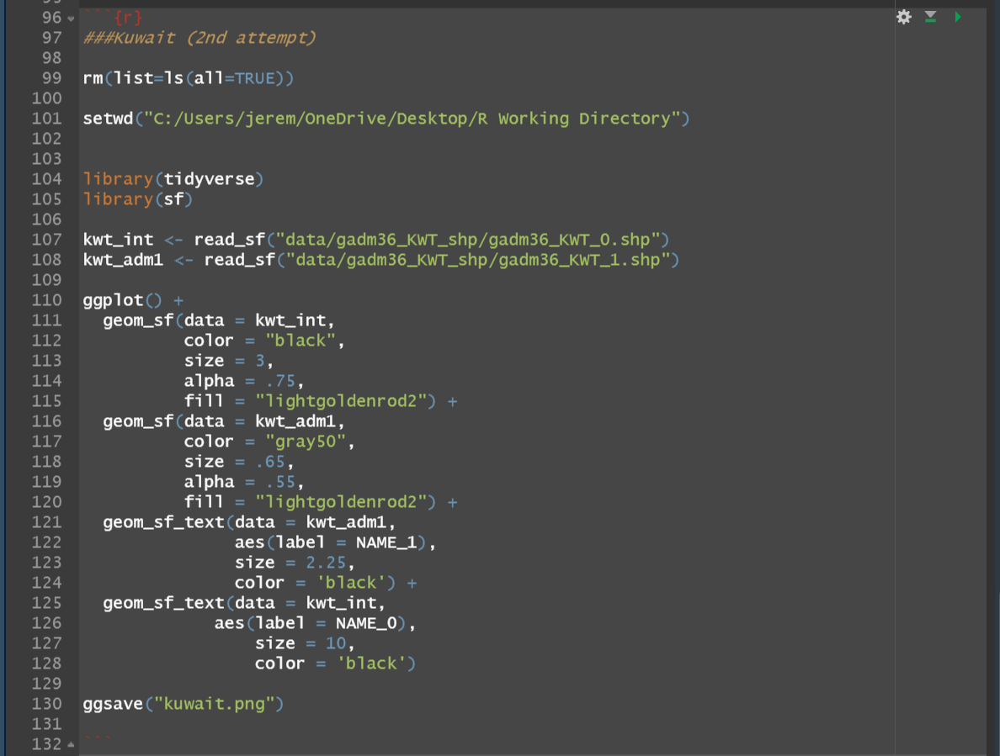

# Team Challenge

[Back to Home Page](https://jeremy-swack.github.io/wicked-problems/)

## The Netherlands

The Netherlands is very densely packed with counties and subdivisions, particularly near the South Holland region where the country has a higher population density.

## My Code:

## Kuwait

Kuwait has fewer counties and subdivisions, so the map is a good bit easier to read.

## My Code:

