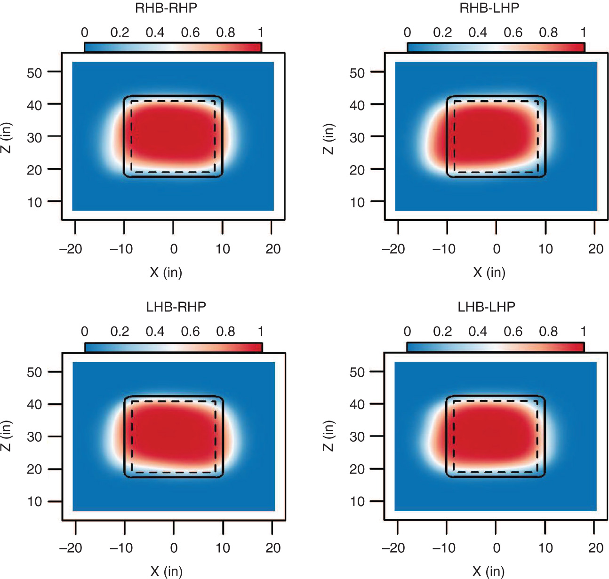

# Data Science Reflection 2

[Back to Home Page](https://jeremy-swack.github.io/wicked-problems/)

## Using a Bayesian Model to Evaluate Catcher Framing in MLB

Baseball is a game full of human error. Even in Major League Baseball (MLB) and its recent adoption of video replay, umpires are required to make impossibly difficult calls on plays that occur in the blink of an eye. The greatest number of these calls occur at home plate; every pitch that is thrown requires a ball or strike call from the home plate umpire. These calls have a dramatic impact on the game as they directly impact a batter’s plate appearance. While most of where a pitch is located is the responsibility of the pitcher himself, recent studies have shown the impact of “catcher framing,” or the ability for the catcher to take a pitch that is out of the strike zone and move it slightly back into the strike zone. This technique is effectively just fooling the umpire, but as long as humans are a part of calling balls and strikes in baseball, catcher framing is an invaluable skill that directly helps teams win games.

Adi Wyner and Sameer Deshpande’s pitch framing model attempts to quantify the total impact catcher framing has on a team’s win total. Created in 2017, the model uses PITCHf/x pitch tracking data to determine the x and y location of every pitch thrown in a given season. By creating heat maps of strike probabilities, it is possible to determine the additional chance a catcher adds to a particular pitch being called a strike. The model also adjusts for the particular umpire, as every umpire has slightly different tendencies for what areas of the strike zone they are more generous or stringent over. Effectively, each umpire has their own probability heat map for their own strike zone. These heat maps can then be applied to catchers to see if they are either increasing or decreasing the probability of a strike being called.

##

An example of strike zone probability heat maps by handedness of hitter and pitcher.
##

Wyner and Deshpande’s model also converts these probabilities into runs saved over the course of a season. This statistic would be value for MLB front offices as paying for catcher framing is not as expensive as paying for other skills, such as hitting and controlling base stealing. The model shows that a good pitch framer can add up to 2-3 wins to a team, which going by the average that every win is worth about 9 million dollars, could potentially save teams millions. Additionally, the statistic, CAFE, has a decent year to year correlation of around .6. This is similar to the year to year correlation of slugging percentage, which is a well agreed upon statistic that has been used for decades to evaluate players. Although teams have now started to catch on to the value of pitch framing and are beginning to try and develop the skill in their existing catchers, it is likely pitch framing is still being undervalued and still represents a market inefficiency in Major League Baseball.

CITATION: Wyner, Abraham, and Sameer Deshpande. “A Hierarchical Bayesian Model of Pitch Framing.” Https://Www.degruyter.com/, 10 Oct. 2017, www.degruyter.com/view/journals/jqas/13/3/article-p95.xml. 
