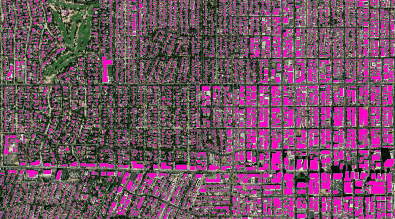

# Using Deep Learning for Object Detection in Satellite Data 

When scrolling through Google Maps, it can be hard to realize the vast amount of information that is being presented on screen. There are thousands of different kinds of structures, in both different layouts and orientations. However, every single house, business, and road is all marked accordingly and accurately, even with new information constantly being added, particularly in remote areas. While the complexity of satellite data is daunting, using deep learning, algorithms have been created to correctly identify different features of a satellite map, including roads, pools, and houses.

The simplest form of this technique is known as image classification, which allows for a computer to label a picture with a certain tag. For example, using an image classification algorithm, a satellite image of Truist Park, home of the Atlanta Braves, could be marked as a high occupancy area. This kind of information can be useful for event planning and traffic management.	

Another example of machine learning in GIS is in a technique known as object detection. This machine learning application can correctly identify where roads, houses, and pools are on a satellite image. By giving the model training data of satellite images, the model can learn what constitutes different features of a map, such as roads, houses, etc. This application is particularly useful in areas with less detailed and developed areas, as the algorithm is still able to give quality information even with poorer quality satellite images. With tools in ArcGIS Pro, smoothing techniques provide even higher quality maps that eliminate any strange geometry that the deep learning algorithm may produce.

An example of a satellite image where the object detection algorithm was used.

CITATION: Singh, Rohit. “Where Deep Learning Meets GIS.” Esri, 8 Sept. 2020, www.esri.com/about/newsroom/arcwatch/where-deep-learning-meets-gis/. 
