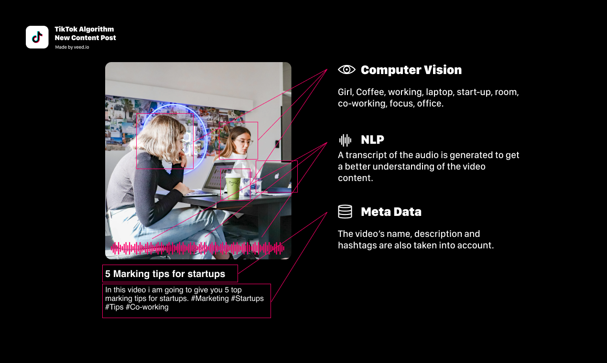
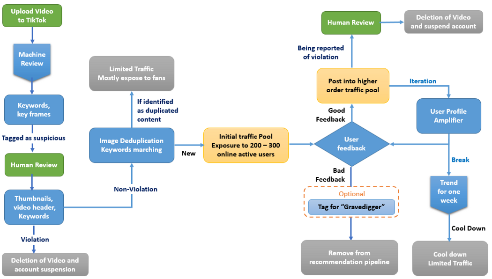

# The TikTok Algorithm

[Back to Home Page](https://jeremy-swack.github.io/wicked-problems/)

While TikTok has been in the news recently for its controversial use of user data, it’s hard to not appreciate the brilliance of the algorithm that powers the For You Page.  When a user first downloads TikTok, they are immediately thrown into the For You Page. This allows the app to immediately start collecting user data to start curating the page to the user’s individual interests. However, TikTok considers much more than just what kinds of videos users are engaging with. On the user side, this data can be broken up into 4 major categories: correlation features, user-scenario features, trend features, and collaborative features. 

Correlation features describe the vector distance between a video and a user’s interests. Hashtags and user tags can influence this distance. User-scenario features include geographic location and time of day. This feature allows TikTok to recommend different videos depending on your routines; for example, the algorithm could differentiate what types of videos a user is engaging with on their commute to work from videos their engaging with on their trip to the Bahamas. Next is trend features, which is how user’s interact with content that contains trends both global and native to TikTok. Lastly, collaborative features focus less on how an individual user behaves, but instead analyze how users who are similar to each other interact. By creating these clusters of user types, TikTok can better predict what content is suitable for its users. 

TikTok uses separate data science techniques for the creation side of its platform. For example, TikTok uses computer vision to discern certain objects in videos and then applies these as tags to a video. In the example below, TikTok likely tagged the video with words girl, coffee, and laptop. Using computer vision is especially important because it allows TikTok to push videos that may have limited text and audio information. Natural Language Processing is also used to analyze the audio of a video.

SOURCES: 
https://towardsdatascience.com/why-tiktok-made-its-user-so-obsessive-the-ai-algorithm-that-got-you-hooked-7895bb1ab423
https://www.axios.com/inside-tiktoks-killer-algorithm-52454fb2-6bab-405d-a407-31954ac1cf16.html
https://www.veed.io/grow/reverse-engineering-how-tiktok-algorithm-works/
