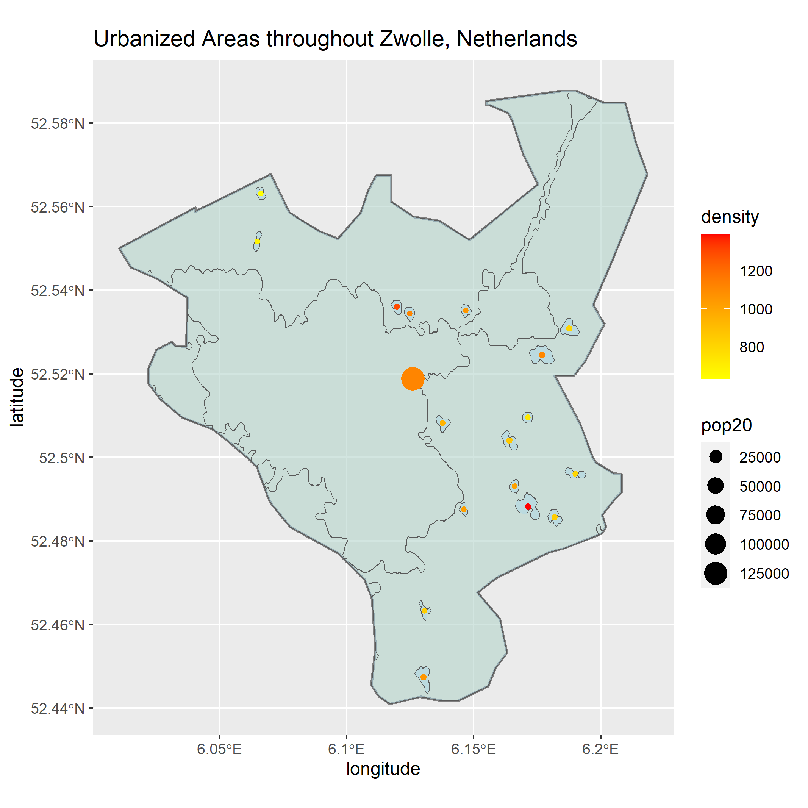
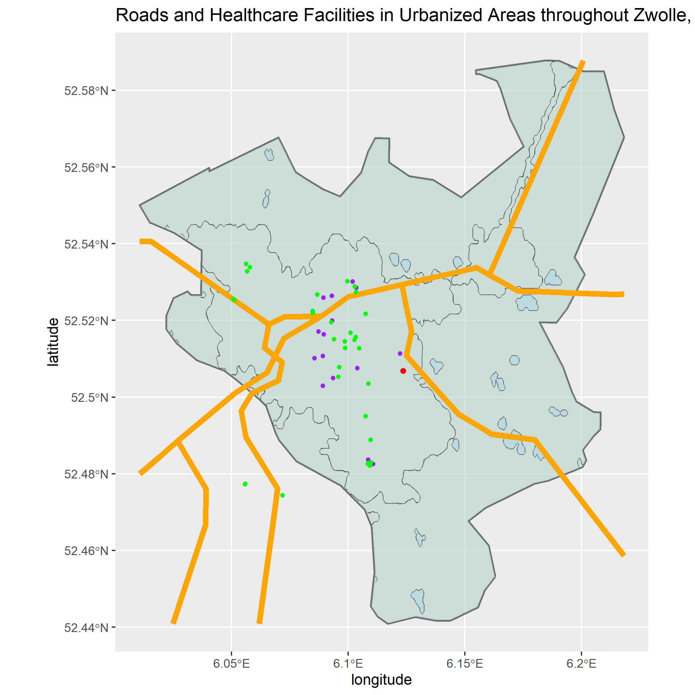

# Final Project

[Back to Home Page](https://jeremy-swack.github.io/wicked-problems/)

## Accessibility 1

This first plot is of the de facto boundaries of human settlements in Zwolle, Netherlands. A big issue I ran into when creating this plot was getting the inside and outside polygons to merge correctly. In the end, I was not able to create exactly the right object, but the plot is still accurate in that the polygons displayed on the plot are the de facto boundaries. The only remaining issue is that the plot doesn't shade correctly because my combined polygon object contains the entire boundary of Zwolle.

## Accessibility 2

This second plot adds the roads and healthcare facilities of Zwolle. The region contains 15 clinics, 1 hospital, and 35 other healthcare facilities. Purple dots are clinics, the red dot is the hospital, and the green dots represent the other kinds of healthcare facilities. Most of the facilties can be found in the most dense polygon located in the center of Zwolle. It is also interesting to note how the road at the top right of Zwolle mirrors the narrow polygon found in the same region. 

## Accessibility 3

Lastly, this is a 3D version of the previous plot with the most dense region, Assendorp, labled as well. Because of the previous issues in Accessibility 1 with my polygons, the de facto boundaries of Zwolle are not shaded correctly. Instead, I opted to make the polygon object I did have black so that these regions could still be seen on my 3D plot. I also decided to both crop and mask my topography raster because Zwolle is landlocked, which meant the unmasked 3D object was a perfect rectangular prisim. Masking the raster made the 3D object into the exact shape of Zwolle. 
