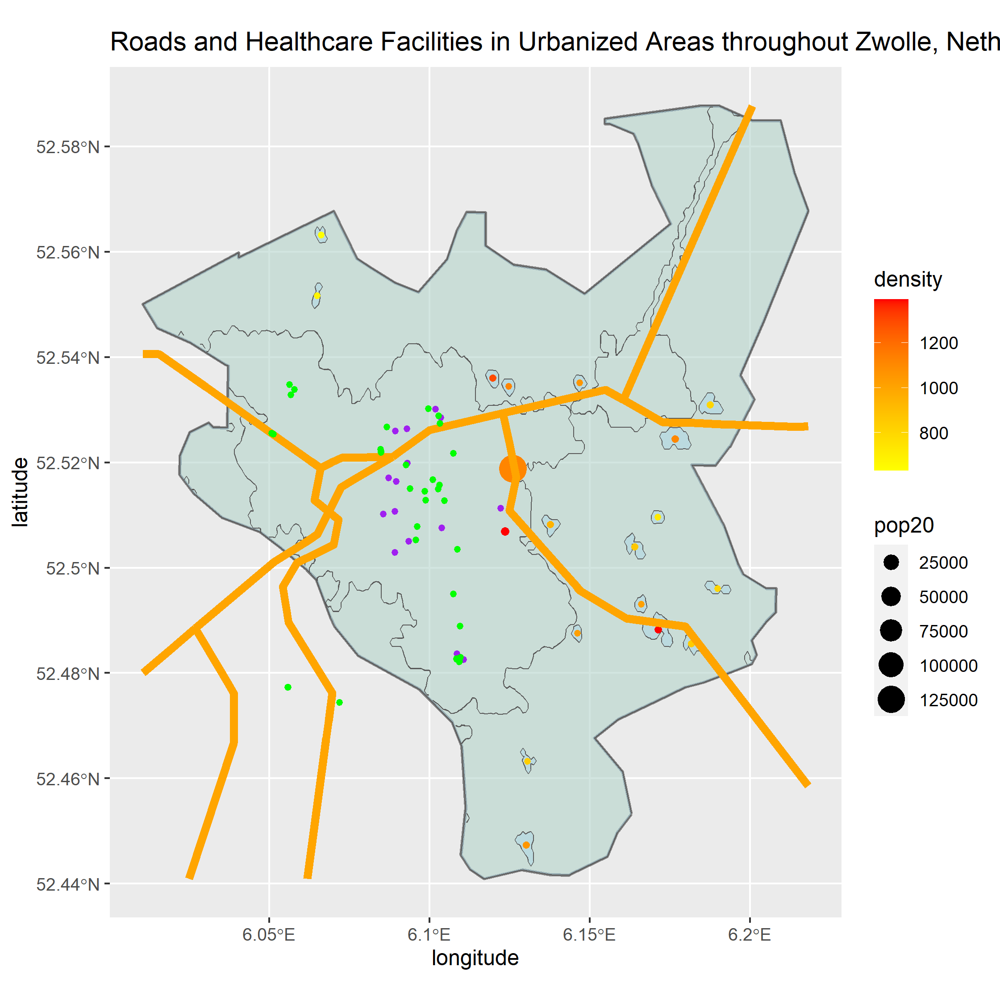

# Final Project

[Back to Home Page](https://jeremy-swack.github.io/wicked-problems/)

## Accessibility 1

This first plot is of the de facto boundaries of human settlements in Zwolle, Netherlands. A big issue I ran into when creating this plot was getting the inside and outside polygons to merge correctly. In the end, I was not able to create exactly the right object, however the plot is still accurate in that the polygons displayed on the plot are the de facto boundaries. The only remaining issue is that the plot doesn't shade correctly because my combined polygon object contains the entire boundary of Zwolle.

## Accessibility 2

This second plot 

## Accessibility 3

