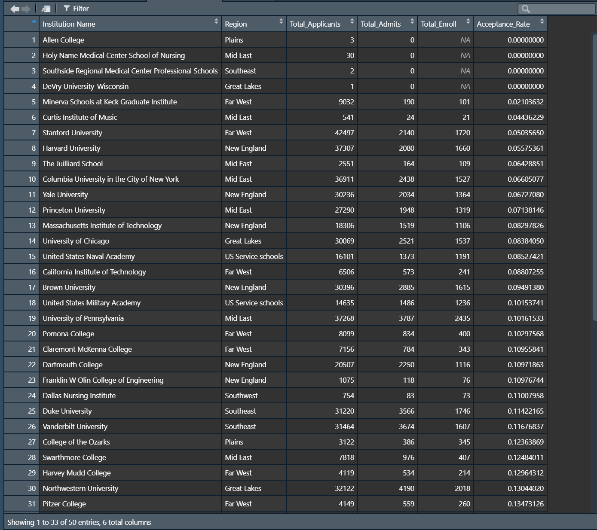
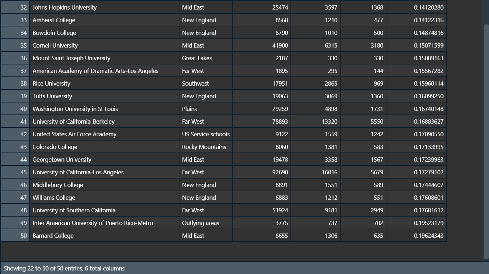

# Project 1, Part 1

[Back to Home Page](https://jeremy-swack.github.io/wicked-problems/)

The following bar plots show the breakdown of the total number of applicants and enrolled students at both 4 year colleges and doctoral programs. The data was downloaded from the National Center for Educational Statistics (NCES). The data is from 2015.

## Applicant Plots

## Enrollment Plots (Stretch Goal 1)

## Top 50 Schools (Stretch Goal 2)

Using the mutate() function, I added an extra column to my data frame to compare the acceptance rates of every single school. To do this, I divided total accepted by total applications. Then, using the arrange() function, I sorted the data frame to give me the 50 lowest acceptance rates

