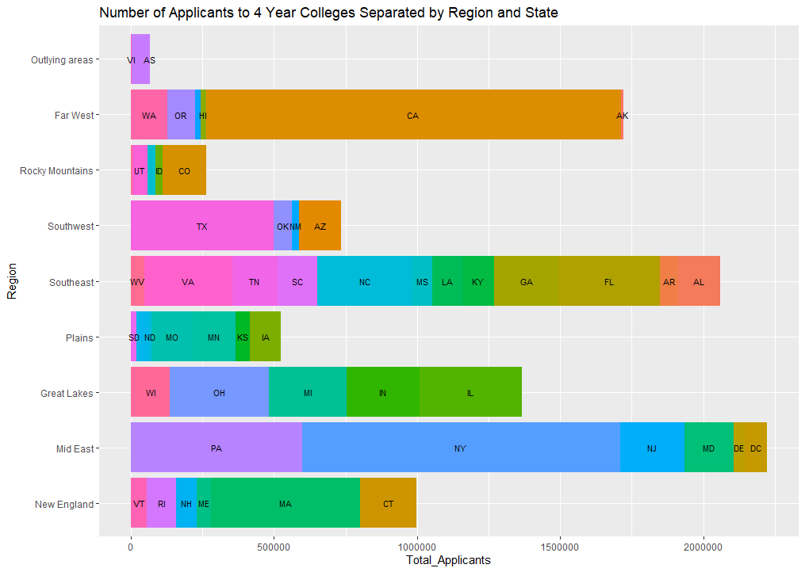
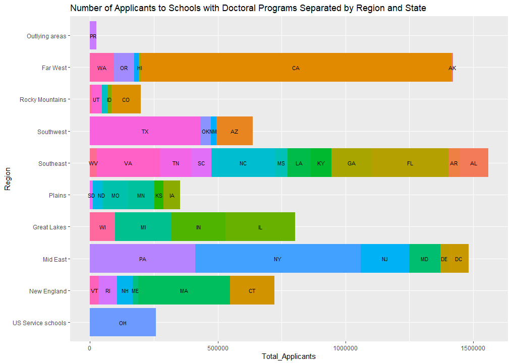
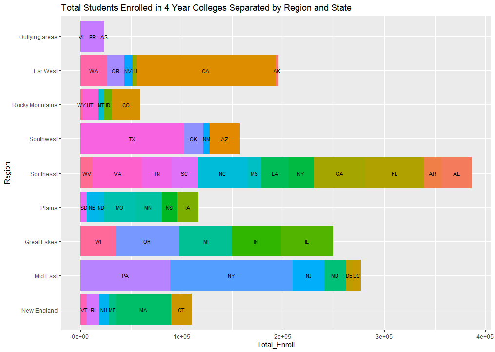
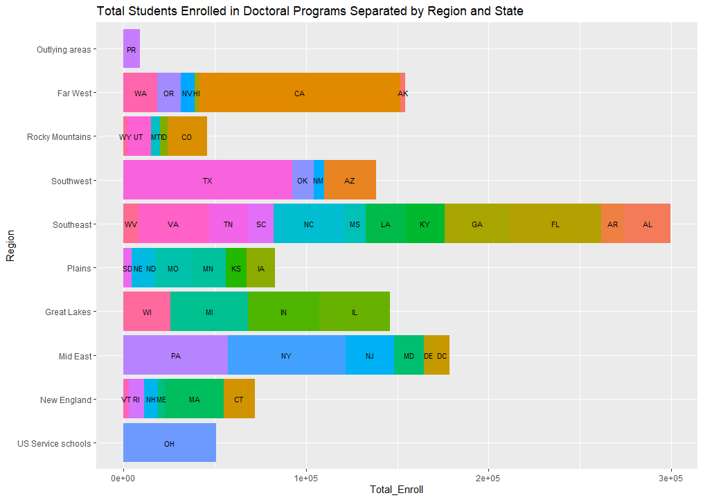

# Project 1, Part 1

The following bar plots show the breakdown of the total number of applicants and enrolled students at both 4 year colleges and doctoral programs. The data was downloaded from the National Center for Educational Statistics (NCES). The data is from 2015.

## Applicant Plots

## Enrollment Plots (Stretch Goal)

