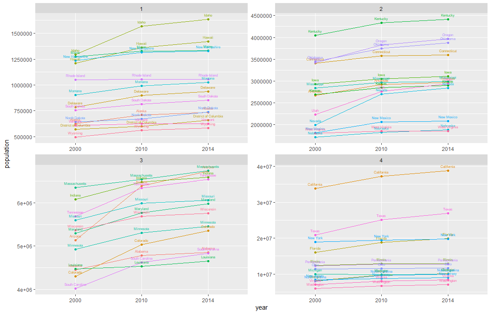

# Project 1, Part 2

[Back to Home Page](https://jeremy-swack.github.io/wicked-problems/)

## The Plots:

These 4 plots show the population of every state and the District of Columbia over the three selected years of 2000, 2010, and 2014. The states and D.C. were then spilt up into 4 different population quantiles. Quantile 1 in the top left has the lowest population states, while quantile 4 in the bottom right has the highest population states. The data is from the U.S. Census.

One challenge I ran into with this part of the project was due to a formatting issue with the census data from 2000. Unlike 2010 and 2014, the data did not come arranged alphabetically by state name. This meant it did not properly align with the other 2 data sets. However, by using the arrange() function and sorting by the state name, this put all 3 data frames in the right order.
