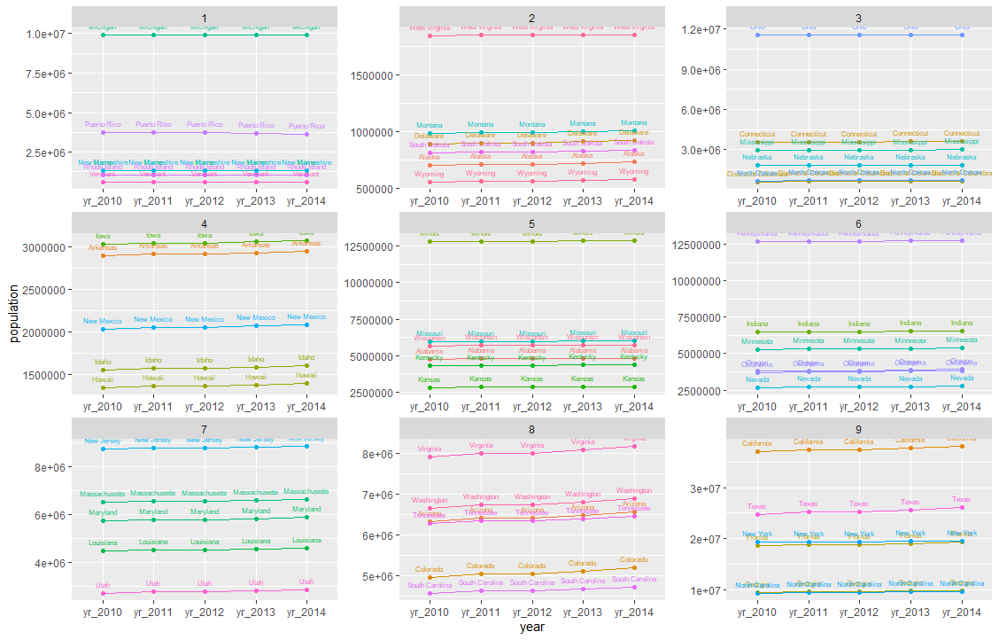
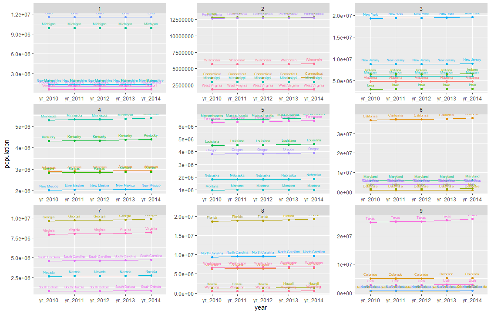

# Project 2, Part 1

[Back to Home Page](https://jeremy-swack.github.io/wicked-problems/)

The goal of this part of the project was to display absolute population growth and the rate of population growth of the United States plus Puerto Rico. U.S. census data from 2010-2014 was used.

## Absolute growth

This plot shows the absolute growth in population of each state from 2010 to 2014. The 9 plots represent the data being broken up into 9 different quantiles. The first quantile is in the top left, and the 9th quantile is in the bottom right.

## Annual Growth Rate

This plot displays the population growth rate of the 50 states. Again, the data is broken into 9 quantiles, with the smallest growth rates being found in the top left and the largest growth rates in the bottom right.

