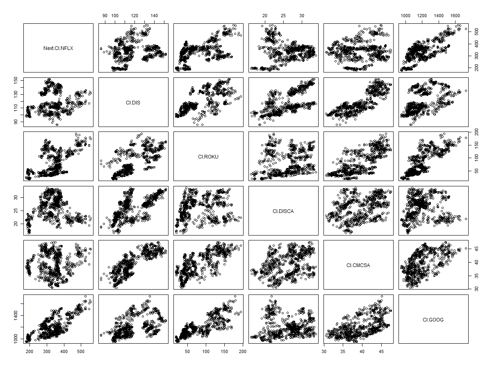
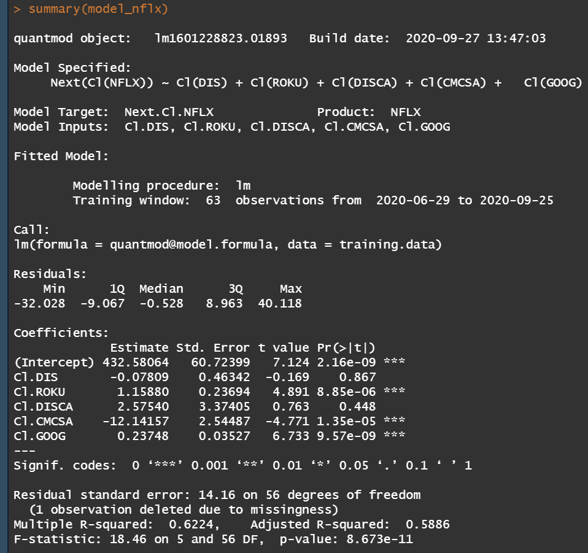

# Project 2, Part1

The goal of this project was to select a group of stocks in a certain industry and pick one to try and predict. For my project, I selected stocks in the streaming service industry. I decided to try and predict the value of Netflix using Disney (Disney+, Hulu), Roku, Discovery Communications (HGTV, Food Network), Comcast (Peacock), and Google (YoutubeTV).

## Correlation Matrix

This correlation matrix shows the correlation between the next close of Netflix and the previous day of either Disney, Roku, Discovery Communications, Comcast, and Google. Generally, the plots have a positive correlation.

## Summary of the Model

This shows the characteristics of the linear model created by 5 predictors (Disney, Roku, Discovery Communications, Comcast, and Google) and the 1 response (Netflix).
