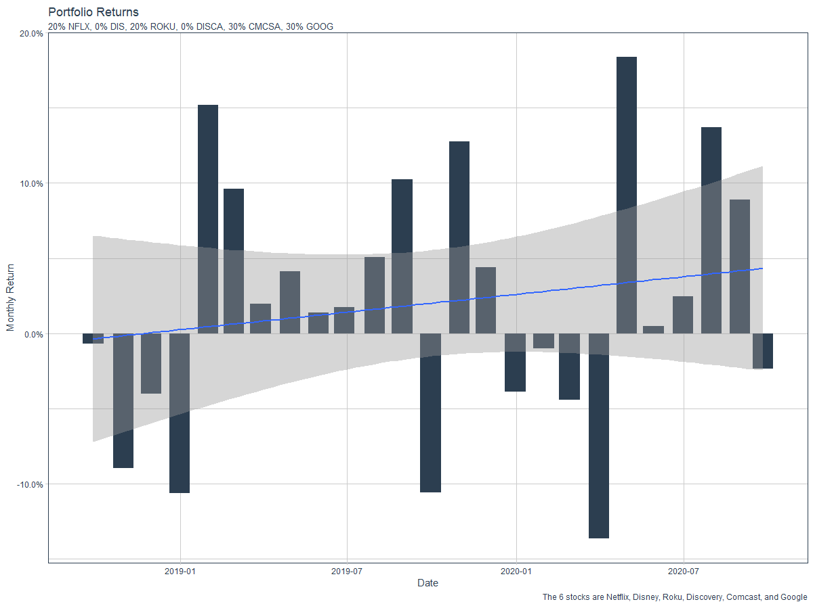
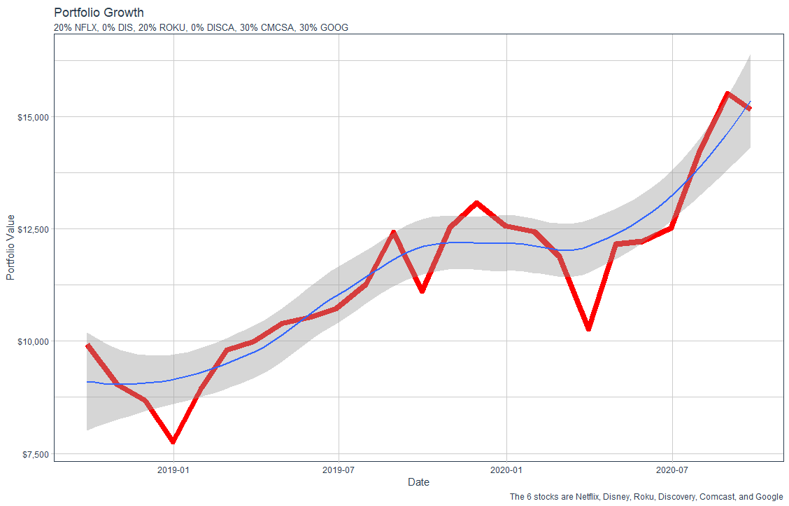

# Project 2, Part 3

[Back to Home Page](https://jeremy-swack.github.io/wicked-problems/)

The goal of this part of the project was to create a profitable investment protfolio with the 6 stocks selected in part 2. I continued to use the 6 streaming stocks I selected in part 2 (NFLX, DIS, ROKU, DISCA, CMCSA, GOOG).

## Portfolio Plot

This plot shows the percent return of the total portfolio over time. The trend line on the plot shows that there was positive growth over the 2 year period, meaning the portfoilio made money.

## Portfolio Growth

This graph shows that total increase in the value of the portfolio. By selecting stocks that were least impacted by the COVID-19 pandemic, the portfolio gave better returns.
