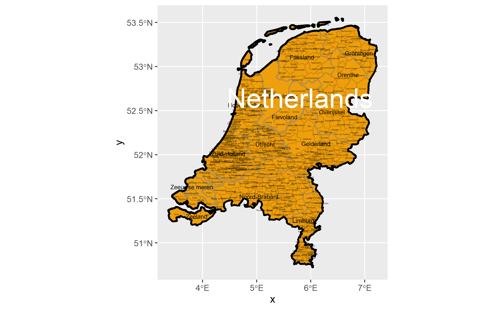
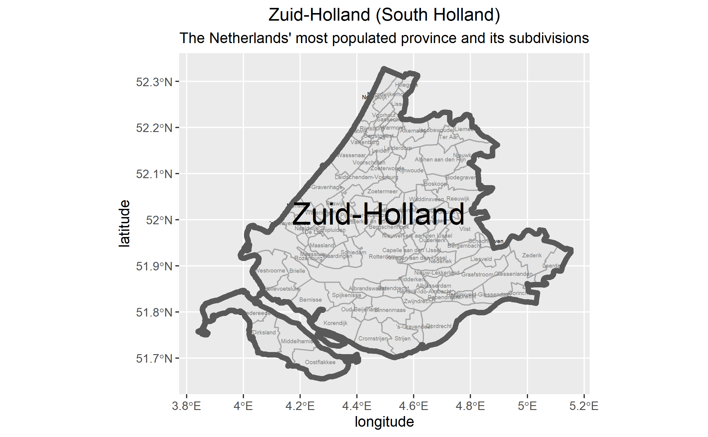
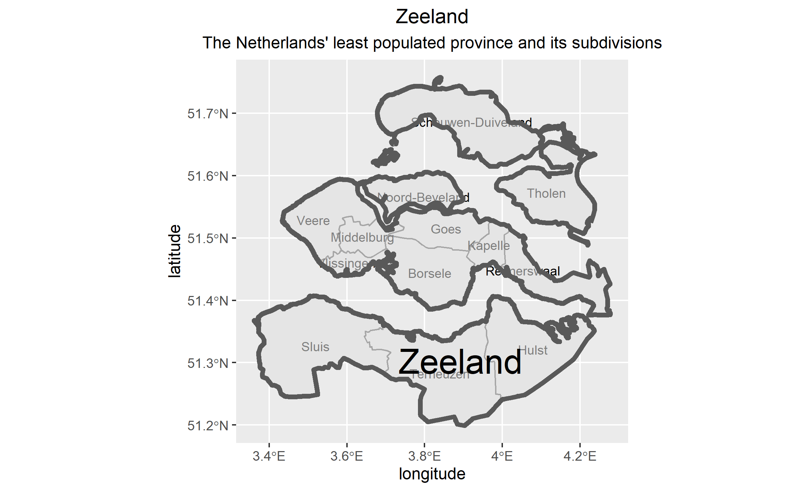
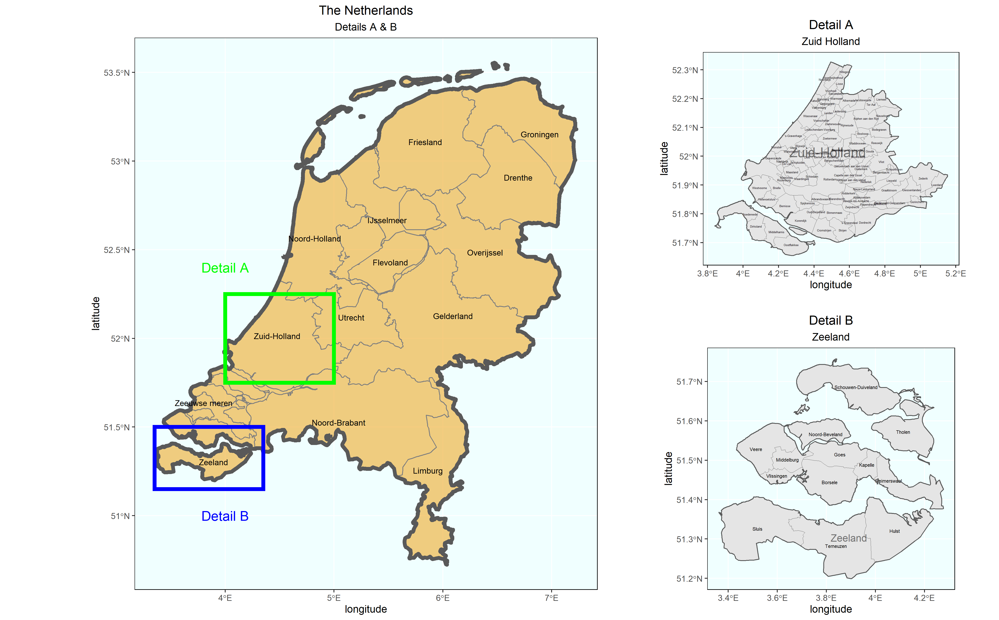

# Project 3, Part 1

[Back to Home Page](https://jeremy-swack.github.io/wicked-problems/)

## The Netherlands (Deliverable)

The Netherlands is very densely packed with provinces and subdivisions, particularly near the South Holland region where the country has a higher population density.

## Map of The Netherlands' Most Popululated Province (Stretch Goal #2)

Zuid Holland, or South Holland, is the most popululated province in the Netherlands. Even when just veiwing this county on its own, the abundance of smaller subdivisions make the map difficult to read.

## Map of The Netherlands' Least Populated Province (Stretch Goal #2)

Zeeland, which is south of Zuid Holland and creates the border between The Netherlands and Belgium.

## Putting it all Together (Stretch Goal #3)

