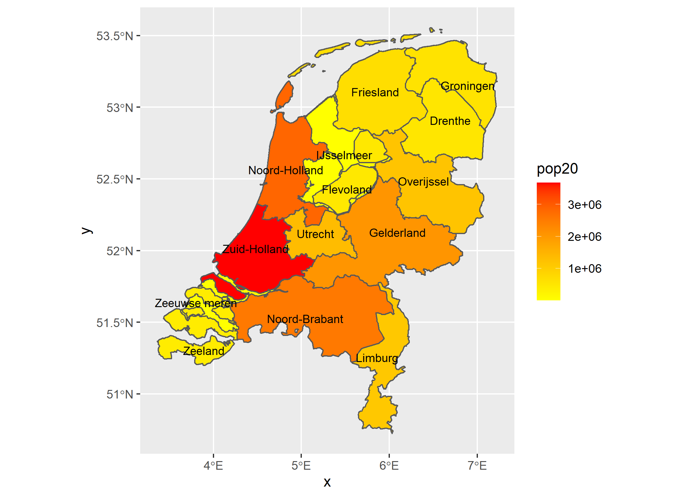
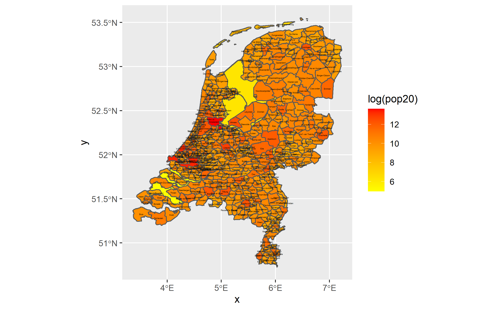
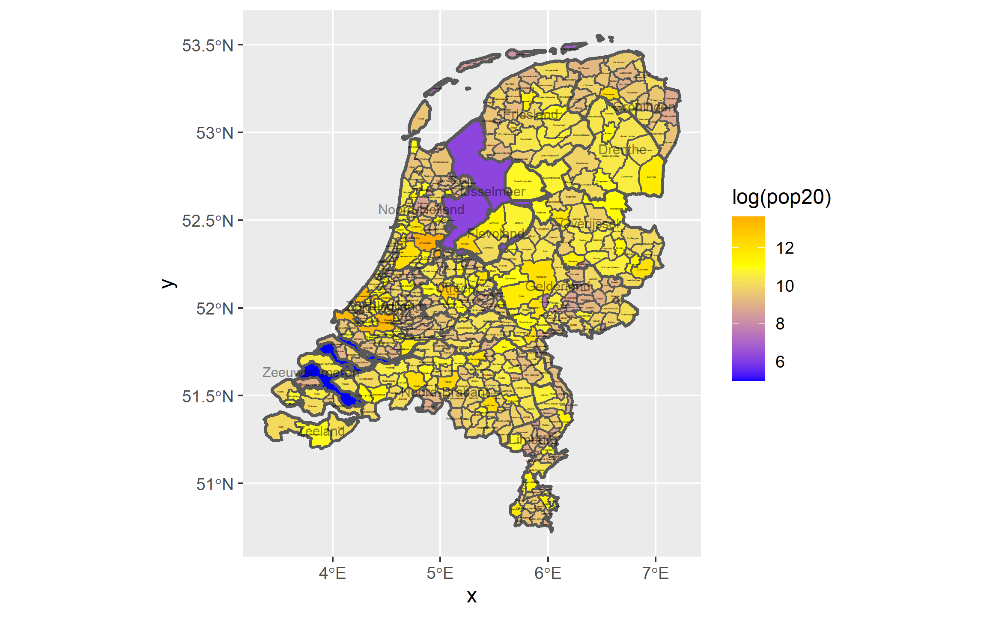
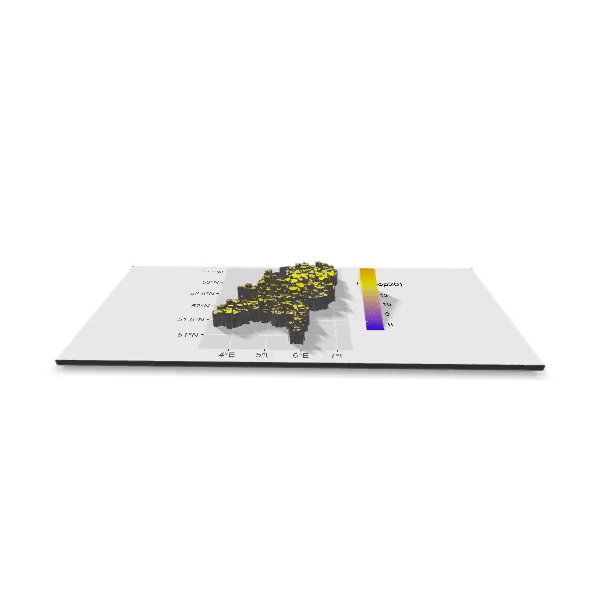

# Project 3, Part 2

[Back to Home Page](https://jeremy-swack.github.io/wicked-problems/)

## Deliverable

This first plot identifies the areas of The Netherlands that have the largest population through the sliding color scale. Areas that are red have the most population, and areas that are yellow have the least population.

## Stretch Goal 1

This second plot shows the log population of every district in The Netherlands. Once again, the red areas have the largest log population and the yellow areas have the lowest log population

## Stretch Goal 2

The third plot shows the log population of all districts with the original area boundaries as well. This plot also has 3 colors for the scale. Low log population correlates to blue, the middle correlates to yellow, and high log population correlates to orange.

## Stretch Goal 3

Lastly, this is a 3D render of the previous 2D plot.

