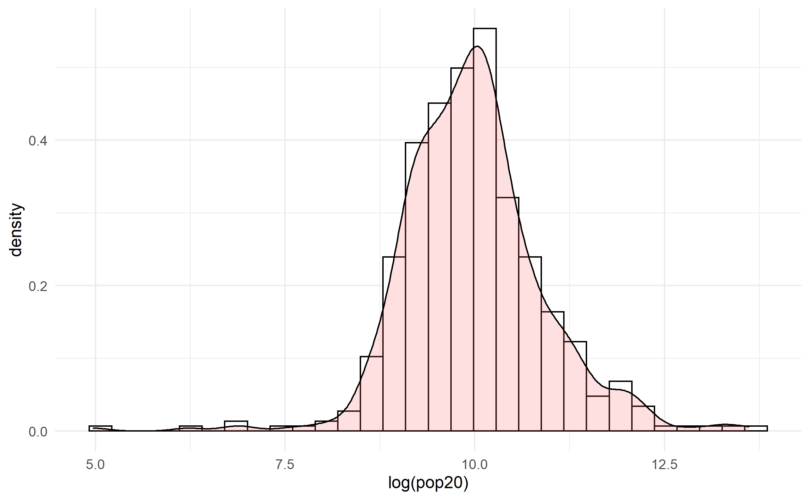
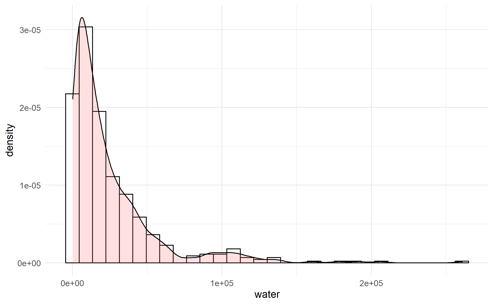

# Project 5 

[Back to Home Page](https://jeremy-swack.github.io/wicked-problems/)

## Part 1 Deliverable 

This density plot shows the distribution of log population in The Netherlands.

This density plot shows the distribution of proximity to water in The Netherlands.

## Part 2 Deliverable 

This plots displays a linear model using all of the variables found in the raster stack. The model has an R^2 value of around .4.

